### Description: Web Screenshot Application on Kubernetes - On-premise Using Rancher.

### Prerequisites:
 - Docker up and running
 - kubectl
 - Rancher
 - Helm

### Architecture in Local Kubernetes Cluster (Rancher):

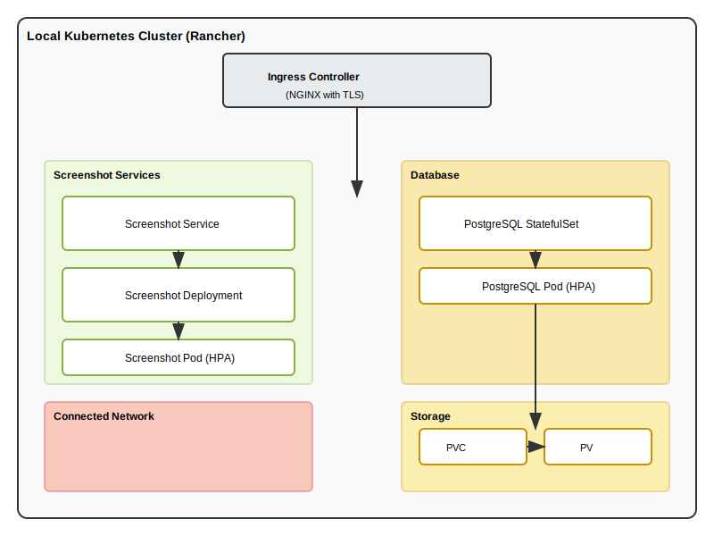

### How to run:
# Deployment instructions:

(pay attention to Step 1 below)
```bash
run the 'sudo scripts/rancher-setup.bash' 
run the 'scripts/cluster-setup.bash'
```

### Explain about the process:

# Steps:

# Step 1: Set up Rancher (in scripts folder)
Set up on-prem k8s cluster. Using Rancher.

Update the host file in you os
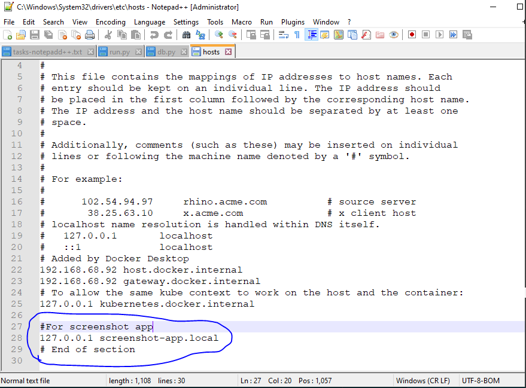

Set Up rancher via the script in /screpts folder
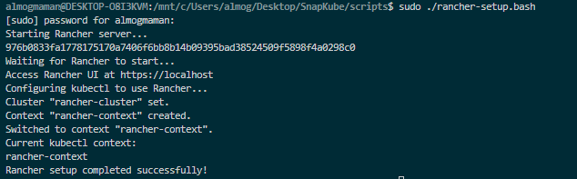

Rancher is accesable
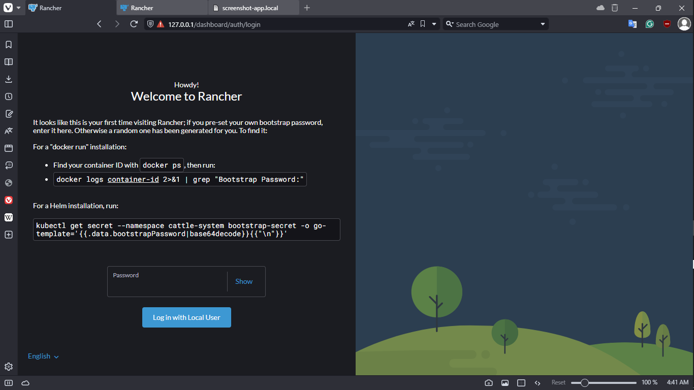

Find the boostrap password and enter to rancher welcome page

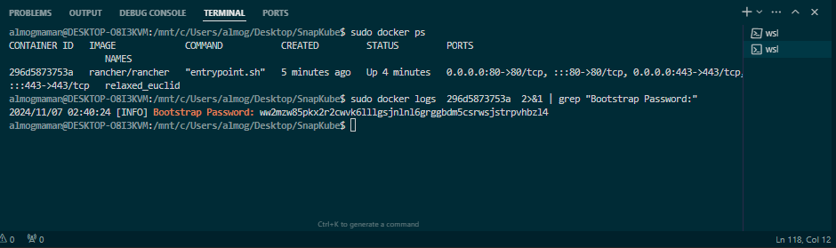

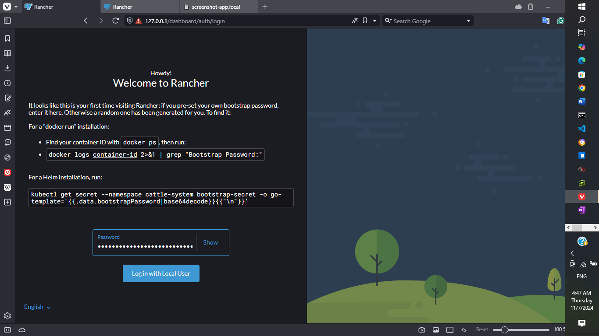

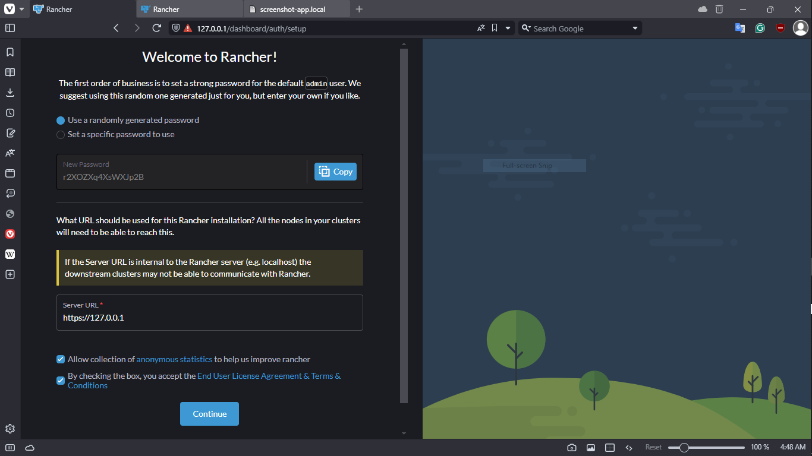

Copy the Kubeconfig content
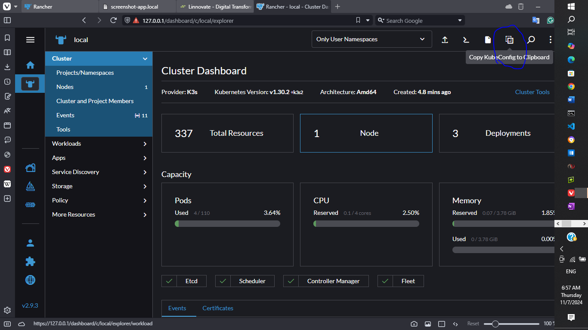

Edit the ~/.kube/config file with the Rancher kubernetes Cluster Kubeconfig info
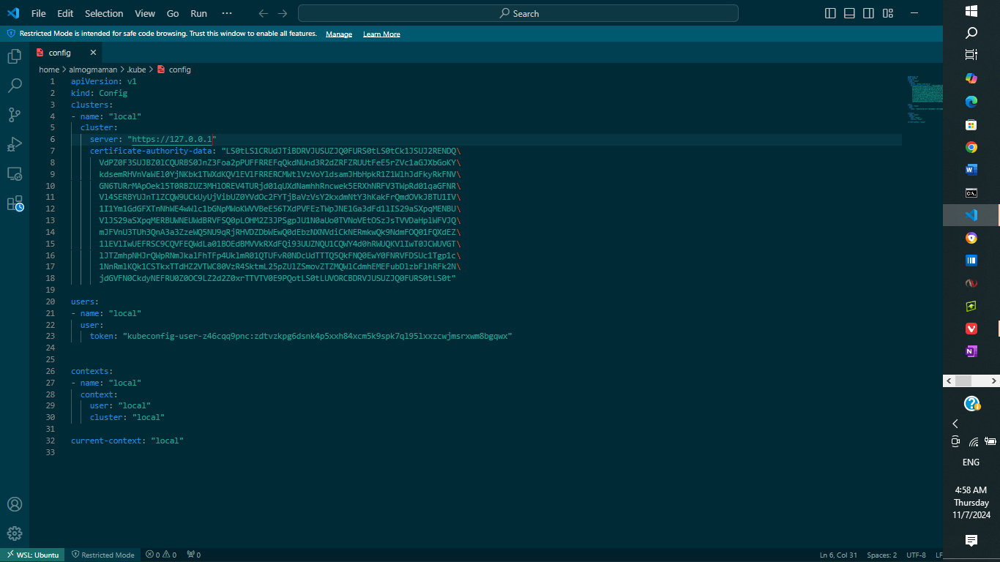

We successfuly set up Rancher
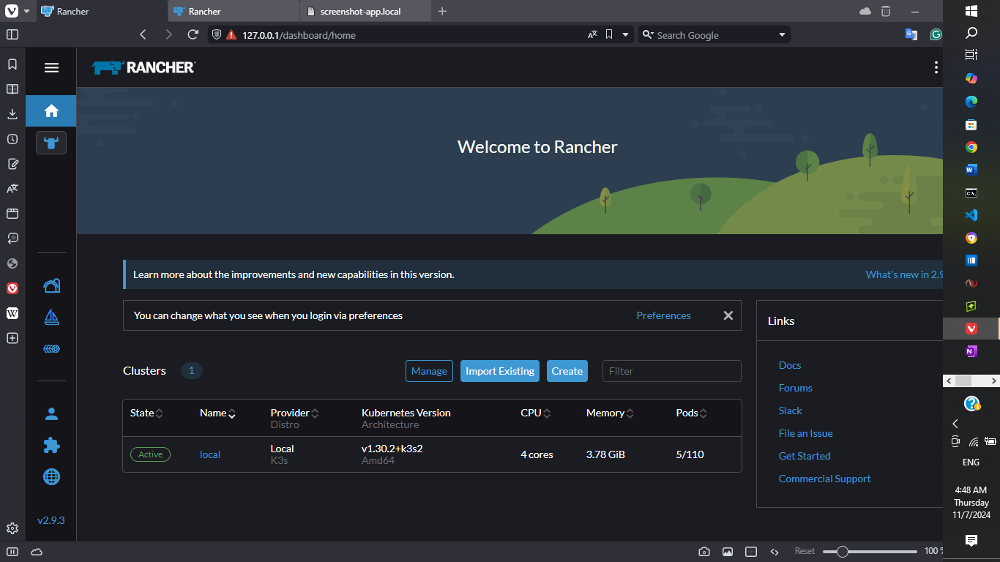


### Notes

- Access Rancher via `https://localhost:443`

- Also, make sure to copy the kubeconfig from the cluster (find it via the Rancher UI) to the `~/.kube/config` file to set up 
  `kubectl` to work properly with the cluster (Rancher).

- Set this in the host file in you os.
  To update the OS host file, add the following line:
  127.0.0.1 screenshot-app.local

- For Linux or macOS, edit the /etc/hosts file:
  sudo nano /etc/hosts

- For Windows, edit the C:\Windows\System32\drivers\etc\hosts file:
  Notepad should be run as Administrator to save changes.


# Step 2: Application Development and Deployment
In this step, we will focus on building the web application, containerizing it, and deploying it to our Kubernetes cluster. The application will be designed to provide users with the ability to capture screenshots of websites. 

To achieve this, we will follow these key tasks:
1. **Build the Application**: Develop a web application using a suitable framework (e.g., Flask for Python) that allows users to input a target website URL. The application will include a user-friendly interface for easy interaction.

2. **Dockerize the Application**: Create a Dockerfile that defines the environment for our application. This will include installing necessary dependencies, setting up the application, and exposing the required ports for communication.

3. **Push to Docker Hub**: Once the application is containerized, we will build the Docker image and push it to Docker Hub. This will make the image accessible for deployment in our Kubernetes cluster.

4. **Deploy in the Cluster**: After pushing the image, we will create Kubernetes manifests (Deployment and Service) to deploy the application in the cluster. This will ensure that the application is running in a scalable and resilient manner.

The application will have the following features:
- Accept user input for a target website URL.
- Capture a screenshot of the specified website using a headless browser (e.g., Selenium or Playwright).
- Store screenshot metadata (such as URL, timestamp, and user information) and file references in a PostgreSQL database for future retrieval and analysis.

By the end of this step, we will have a fully functional web application deployed in our Kubernetes cluster, ready to accept user requests and capture screenshots efficiently.

# Step 3:
Set the ingress controller with a TLS self-signed certificate to ensure secure communication between users and the application. This step is crucial for protecting sensitive data transmitted over the network. 

First, we will deploy the NGINX Ingress Controller, which will manage the routing of external traffic to our application services within the Kubernetes cluster. After deploying the ingress controller, we will create an ingress resource that defines the routing rules for our application.

Next, we will generate a self-signed certificate to enable HTTPS. This certificate will be used by the ingress controller to encrypt the traffic. We can use tools like OpenSSL to create the certificate and key files, which will then be referenced in our ingress resource.

Once the ingress controller is set up and the TLS certificate is configured, we will verify that the application is accessible via the ingress controller using the specified hostname. This setup will allow users to interact with the application securely over the internet, ensuring that their data remains confidential.

Now we have the application running in the cluster, accessible via the ingress controller (NGINX), providing a seamless and secure user experience.

# Step 4:
To set up PostgreSQL as my database in the cluster, we will use a StatefulSet resource. This approach ensures that each PostgreSQL instance has a stable network identity and persistent storage, which is crucial for database applications. 

First, we will create a PersistentVolumeClaim (PVC) to request storage resources from the cluster. Then, we will define the StatefulSet, specifying the PostgreSQL image, environment variables for database configuration, and the volume mounts to link the PVC to the PostgreSQL pods. 

Make sure to configure the necessary service to allow communication between the application and the PostgreSQL database. This setup will provide a reliable and scalable database solution for our application.


# Start of Selection
# Step 5:
In this step, we will ensure that the application is properly integrated with the PostgreSQL database. This involves several key tasks to guarantee smooth communication and data handling between the application and the database.

First, we will verify the database connection settings in the application configuration. This includes specifying the correct database URL, username, and password. It is essential to ensure that the application can authenticate and connect to the PostgreSQL instance without issues.

Next, we will implement the necessary database models and schemas within the application. This will involve defining the tables for storing user data, screenshot metadata, and any other relevant information. We will use an Object-Relational Mapping (ORM) tool, such as SQLAlchemy, to facilitate interactions with the database in a more Pythonic way.

After setting up the models, we will write the functions to handle CRUD (Create, Read, Update, Delete) operations. This will allow the application to save screenshots, retrieve metadata, and manage user information effectively. We will also implement error handling to manage any potential issues that may arise during database operations.

Finally, we will conduct thorough testing to ensure that the application interacts with the PostgreSQL database as expected. This will include unit tests for individual functions and integration tests to verify the overall functionality of the application with the database.

By the end of this step, we will have a fully functional application that works seamlessly with the PostgreSQL database, enabling efficient data storage and retrieval for our web screenshot service.

Access the application (via nginx ingress controller)
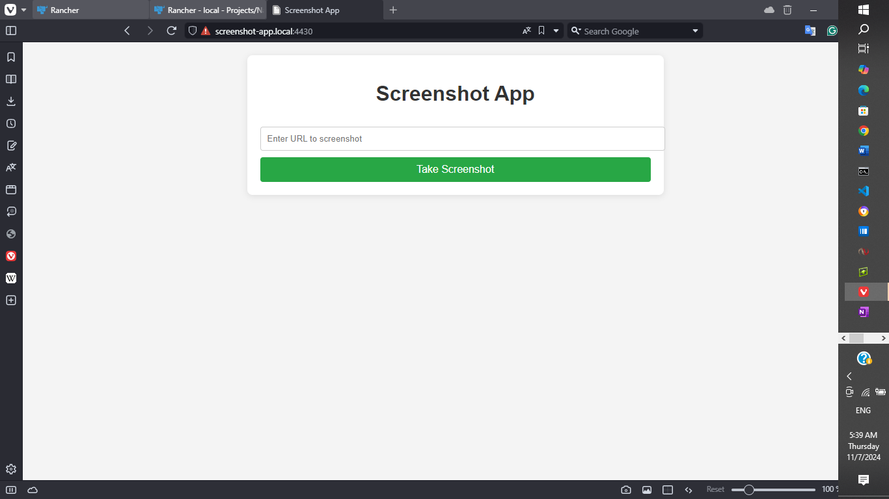

Checking validation of input
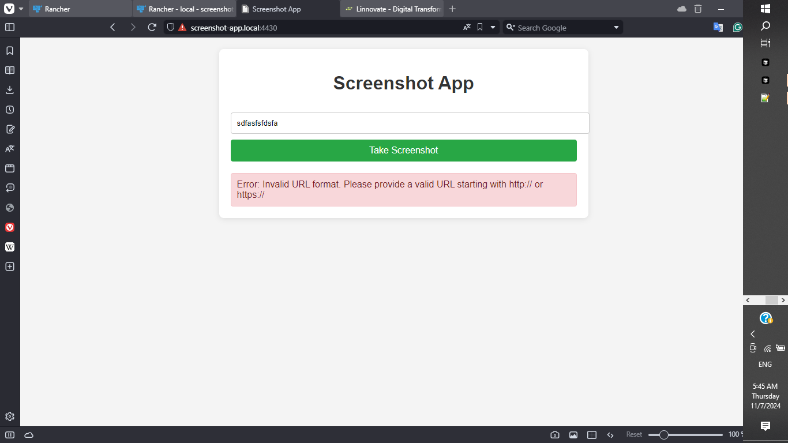

Successful Url screenshot and db update acured
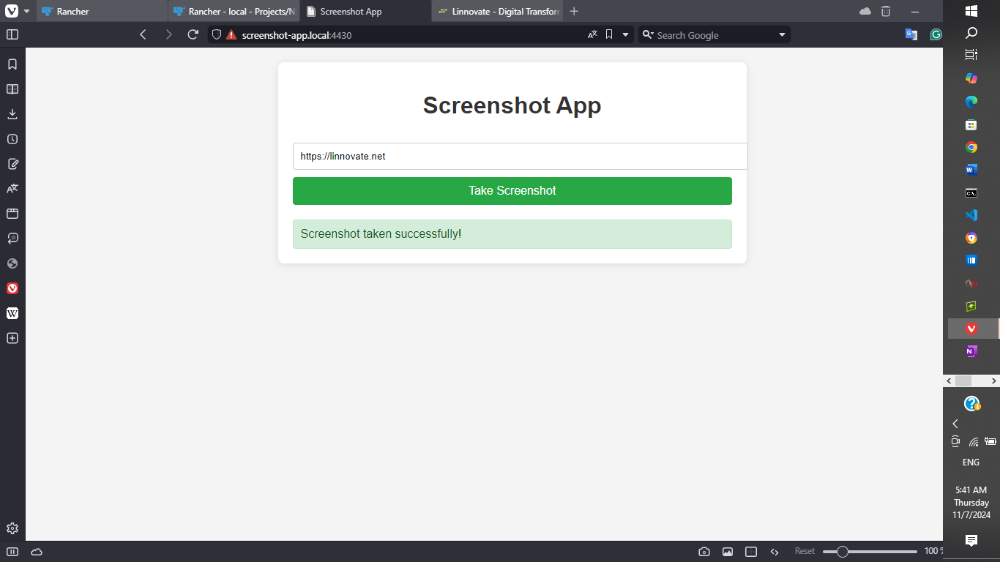

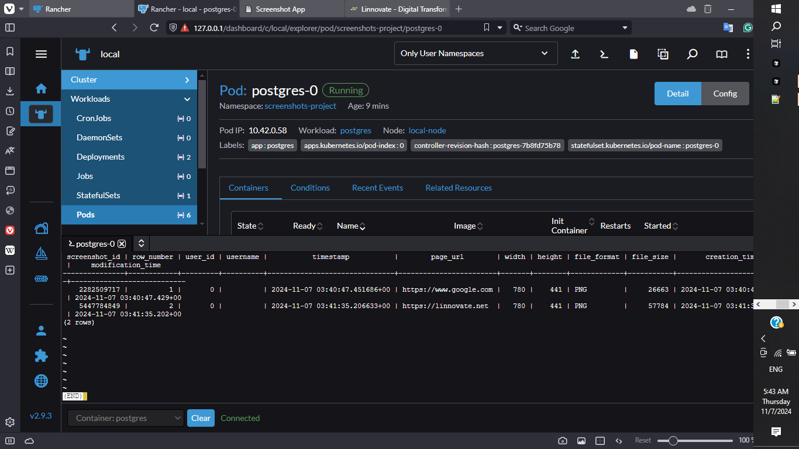


### Cleanup:
```bash
run 'scripts/cluster-cleanup.bash'
run 'sudo scripts/rancher-cleanup.bash'
```

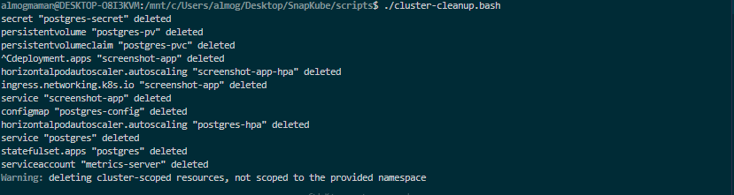

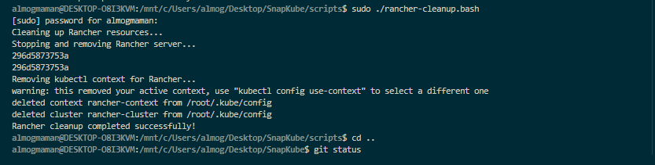


# UPCOMMING:
 - CI/CD
 - Monitoring
 - Logging   
