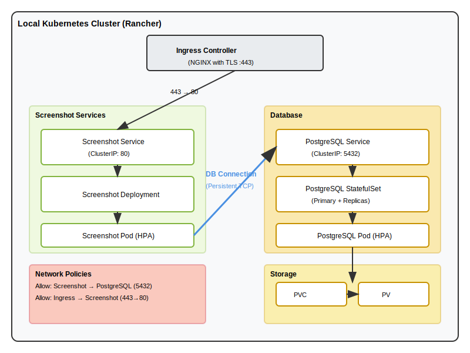
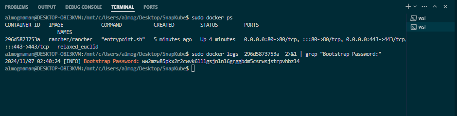

### Description: Web Screenshot Application on Kubernetes - On-premise Using Rancher.

### Prerequisites:
 - Docker up and running
 - kubectl
 - Rancher
 - Helm

### Architecture in Local Kubernetes Cluster (Rancher):



### How to run:
# Deployment instructions:

```bash
run the 'sudo scripts/rancher-setup.bash' (pay attention to Step 1 below)
run the 'scripts/cluster-setup.bash'

### Explain about the process:

# Steps:

# Step 1: Set up Rancher (in scripts folder)
Set up on-prem k8s cluster. Using Rancher.





### Notes

Pay attention that in the process, Rancher will ask for a username and password. We need to access Rancher via the Rancher URL - `localhost:443`. From there, there is a command to find the Bootstrap Password, and then we can choose a password. Enter the password, agree to the terms, and hit continue. Now you have the password for the admin user.

Also, make sure to copy the kubeconfig from the cluster (find it via the Rancher UI) to the `~/.kube/config` file to set up `kubectl` to work properly with the cluster (Rancher).
Set this in the host file in you os.
To update the OS host file, add the following line:
127.0.0.1 screenshot-app.local
For Linux or macOS, edit the /etc/hosts file:
sudo nano /etc/hosts
For Windows, edit the C:\Windows\System32\drivers\etc\hosts file:
Notepad should be run as Administrator to save changes.


# Step2:
Build the application, dockerize it and push it to the docker hub, deploy it in the cluster.
With these features:
    - Accept user input for a target website URL.
    - Capture a screenshot of the specified website.
    - Store screenshot metadata and file references in a database.

# Step 3:
Set the ingress controller with TLS self signed Certificate.
Set up the application and the ingress controller.
Now we have the application running in the cluster accesible via ingress controller (nginx)

# Step 4:
Set up postgressSql as my db. via stetful set.


# Step 5:
Adjust the application working properly with the postgressSQL db.
#Adding pictures here of postgress working with the app.


### Cleanup:
run 'scripts/cluster-cleanup.bash'
run 'sudo scripts/rancher-cleanup.bash'


# UPCOMMING:
 - CI/CD
 - Monitoring
 - Logging   
